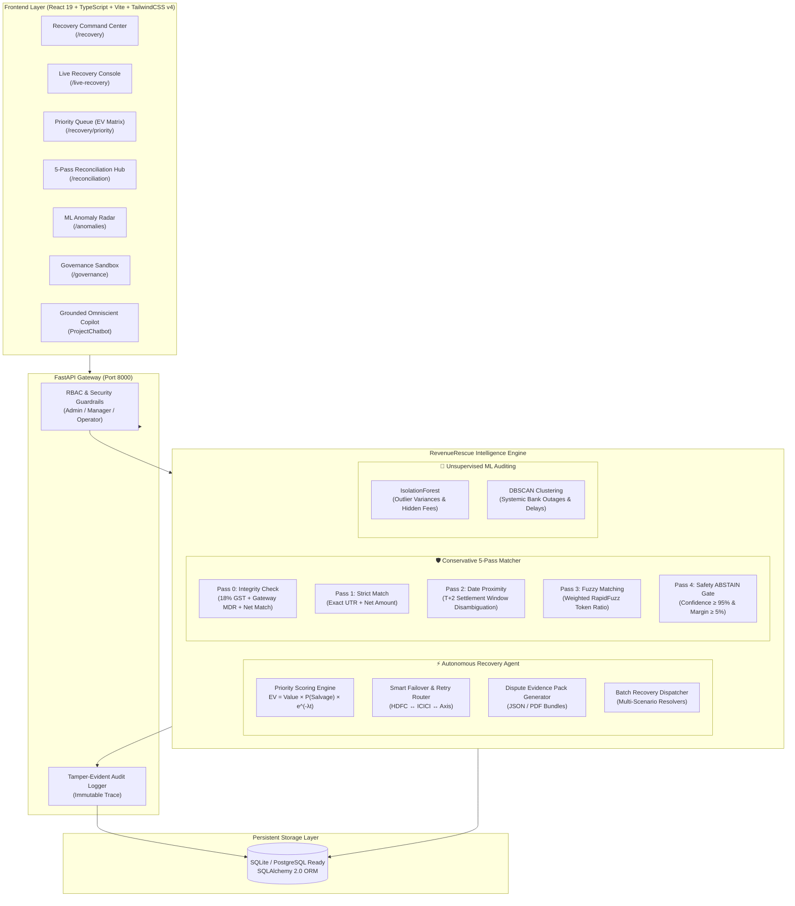

<div align="center">

# 🚀 RevenueRescue AI
### Autonomous Revenue Recovery Agent & Risk-Aware Settlement Reconciliation
**"Detect. Decide. Recover."**

[](https://fastapi.tiangolo.com)
[](https://react.dev)
[](https://www.typescriptlang.org)
[](https://tailwindcss.com)
[](https://www.python.org)
[](https://vitejs.dev)
[](LICENSE)

<p align="center">
  <a href="#-the-problem-and-solution">Problem & Solution</a> •
  <a href="#-system-architecture">System Architecture</a> •
  <a href="#-core-innovations">Core Innovations</a> •
  <a href="#-ui-route-map">UI Route Map</a> •
  <a href="#-comprehensive-25-scenario-matrix">25 Scenarios</a> •
  <a href="#-quick-start-guide">Quick Start</a> •
  <a href="#-role-based-access-control-rbac">Demo Accounts</a> •
  <a href="#-api-reference">API Reference</a>
</p>

</div>

---

## 📌 Executive Summary

**RevenueRescue AI** (incorporating the *FinanceTwin* risk-aware reconciliation core) is an enterprise-grade, autonomous revenue recovery agent and conservative settlement reconciliation platform built for payment aggregators, fintechs, and high-volume merchant ecosystems.

### 🛑 The Cost of Legacy Inefficiencies
1. **Silent Revenue Leakage**: 2-5% of total GMV is lost annually to transient bank network drops, expired checkout sessions, silent webhook failures, and uncollected accounts receivable.
2. **Catastrophic False Matches**: Conventional reconciliation engines optimize blindly for high match volume, forcing ambiguous matches that corrupt General Ledgers and trigger false tax liabilities.

### 💡 The RevenueRescue AI Solution
* **Autonomous Revenue Recovery Agent**: Detects failed checkouts, gateway drops, and overdue receivables in real time. It calculates explainable **Expected Value (EV)** recovery scores, automates multi-channel retries, executes smart gateway failovers, and compiles one-click dispute evidence packs.
* **Conservative 5-Pass Settlement Reconciliation**: Enforces strict mathematical safety gates. Instead of forcing uncertain matches, it triggers deterministic **ABSTAIN** actions to ensure a **0.0% False Match Rate (FMR)**.
* **Grounded Omniscient AI Copilot**: A context-aware operations copilot connected directly to live SQLite database telemetry, capable of answering natural-language queries across cases, transactions, and audit logs.

---

## 🏗️ System Architecture



---

## 🌟 Core Innovations

### 1. ⚡ Autonomous Revenue Recovery Engine
* **Explainable Priority Matrix (EV Score)**: Every recoverable case is ranked dynamically based on salvageability probability, recoverable balance, customer tier, and time-decay penalty:
  $$\text{EV} = \text{Recoverable Balance} \times P(\text{Salvageability}) \times e^{-\lambda \cdot \text{Age in Days}}$$
* **Live Interactive Agent Console (`/live-recovery`)**: Watch the agent execute autonomous recovery workflows step-by-step with real-time decision trees, smart failover routing, and merchant communications.
* **Smart Failover Payment Routing**: Automatically reroutes failing bank rails (e.g. from HDFC NetBanking timeout to ICICI UPI rail) during systemic bank dips.
* **Dispute Evidence Pack Generator**: One-click generation of audit-ready proof-of-fulfillment and gateway logs for chargeback disputes.

### 2. 🛡️ Conservative 5-Pass Settlement Reconciliation
* **Pass 0 (Integrity Validation)**: Validates that Gross Payment minus 18% GST and gateway MDR matches net batch payouts before running matching algorithms.
* **Pass 1 (Strict Deterministic Match)**: Matches exact UTR reference IDs and currency values.
* **Pass 2 (Date Proximity T+2)**: Evaluates settlement date proximity and single-candidate allocations.
* **Pass 3 (Weighted Fuzzy Matching)**: RapidFuzz token matching on bank narration strings and customer names.
* **Pass 4 (Safety ABSTAIN Gate)**: Validates minimum confidence score ($\ge 95\%$) and candidate score margin ($\ge 5\%$). If not satisfied, the engine safely **ABSTAINS** to protect ledger integrity.

### 3. 🧠 Machine Learning Anomaly Radar
* **IsolationForest**: Unsupervised multi-variate outlier detection that catches hidden fees, surcharge anomalies, and high-value exposures.
* **DBSCAN Clustering**: Identifies systemic bank outages, recurring delay clusters, and routing degradation patterns across time and bank rails.

### 4. 💬 Grounded AI Copilot (`ProjectChatbot`)
* Accessible globally across all pages.
* Grounded in live SQLite database state, transaction logs, recovery metrics, and reconciliation policies.
* Answers complex questions like:
  > *"Which bank rail experienced the highest failure rate yesterday?"*  
  > *"What are the top 3 high-priority recovery cases above ₹50,000?"*  
  > *"Explain why case REC-0012 was escalated to Human Review."*

### 5. ⚙️ Enterprise Governance Simulator & Auditability
* **Policy Sandbox (`/governance`, `/simulator`)**: Model the impact of changing confidence thresholds, margin limits, and auto-approval caps against historical data before deployment.
* **Tamper-Evident Audit Trail (`/audit`)**: Every automated rescue, manual operator override, and policy change is logged with cryptographic actor metadata.
* **Integrated Fintech Glossary (`TermTooltip`)**: In-app hover tooltips explaining terms like *FMR*, *UTR*, *MDR*, *T+2 Settlement*, *Chargeback Reserve*, and *EV Score*.

---

## 🗺️ UI Route Map (21 Interactive Views)

| Route | Page Name | Description & Key Features |
|---|---|---|
| `/` | **Landing Page** | Product overview, live metrics preview, architecture showcase, and ROI calculator. |
| `/recovery` | **Recovery Command Center** | Executive recovery HQ, leakage velocity charts, salvageable capital metrics, and active workflows. |
| `/live-recovery` | **Live Recovery Console** | Interactive real-time agent console with step-by-step decision trees and execution traces. |
| `/recovery/priority` | **Priority Queue** | EV-ranked recovery queue with SLA countdowns, risk tiers, and 1-click rescue triggers. |
| `/operator-queue` | **Operator Queue** | Triage console for recovery specialists to review flagged cases and take bulk action. |
| `/recovery/batch` | **Batch Recovery Engine** | Multi-scenario bulk rescue dispatcher (Bank Timeouts, 5xx Drops, Expired Checkouts). |
| `/recovery/cases` | **Recovery Cases Directory** | Full searchable case lifecycle directory with filtering by stage, failure reason, and tier. |
| `/recovery/cases/:id` | **Case Detail & Evidence** | Case timeline, dispute evidence pack generator, communication logs, and audit trail. |
| `/leakage` | **Revenue Leakage Analytics** | Root-cause leakage breakdown, gateway SLA drift, fee overcharges, and salvageable capital. |
| `/intelligence` | **Recovery Intelligence** | Deep analytics on recovery success rates, channel effectiveness, and latency curves. |
| `/dashboard` | **Executive Reconciliation** | High-level match rates, break counts, fee variance charts, and settlement volume KPIs. |
| `/reconciliation` | **5-Pass Matcher Console** | Interactive execution of Pass 0–4 matcher with candidate review and break diagnostics. |
| `/exceptions` | **Exception Center** | Unmatched breaks directory categorized by root cause (fee discrepancy, missing UTR, delay). |
| `/exceptions/:id` | **Exception Break Detail** | Deep break investigation view with candidate side-by-side comparison and AI root cause. |
| `/anomalies` | **ML Anomaly Radar** | Interactive IsolationForest outlier scatter plots & DBSCAN delay clustering charts. |
| `/governance` | **Governance & Guardrails** | Safety threshold configuration (confidence minimums, margin safeguards, approval limits). |
| `/simulator` | **Policy Sandbox Simulator** | Dynamic sandbox to simulate the effect of policy changes on match rate vs false match risk. |
| `/calculator` | **ROI & Cost Calculator** | Interactive modeler for estimating annual revenue recovered and false match cost reduction. |
| `/audit` | **Tamper-Evident Audit Logs** | Immutable system ledger events, role access traces, and action decision history. |
| `/login` | **Authentication Console** | 1-Click role-switching console for Admin, Manager, and Operator personas. |
| `/about` | **System Documentation** | Architectural manifesto, algorithmic principles, and compliance whitepaper. |

---

## 🧪 Comprehensive 25-Scenario Matrix

The platform is validated against 25 realistic production scenarios covering every failure mode in payments and reconciliation:

| # | Scenario Name | Primary Anomaly / Edge Case | Engine Handling & Safety Action |
|:---:|---|---|---|
| **1** | **Strict Deterministic Match** | Clean UTR & exact net amount | Matched instantly in **Pass 1** |
| **2** | **Date Proximity Settlement** | T+2 settlement delay with exact UTR | Matched in **Pass 2** Date Proximity |
| **3** | **Fuzzy Narration Discrepancy** | Minor typo in bank narration | Matched in **Pass 3** (RapidFuzz Score > 95%) |
| **4** | **Ambiguous Candidate Score** | Best candidate confidence = 91.2% (< 95%) | **Pass 4 ABSTAIN** — Prevented False Match |
| **5** | **Narrow Candidate Margin** | Top 2 candidates within 2.1% margin (< 5%) | **Pass 4 ABSTAIN** — Margin Safety Triggered |
| **6** | **MDR Fee Discrepancy** | Gateway deducted 2.8% instead of agreed 2.0% | Flagged in **Pass 0** Fee Integrity Check |
| **7** | **GST Tax Calculation Error** | 12% GST applied instead of statutory 18% | Flagged in **Pass 0** Tax Integrity Check |
| **8** | **Partial Settlement Credit** | Bank credited ₹45,000 on ₹50,000 batch | Under-credit Exception created with ₹5,000 break |
| **9** | **Surplus Bank Credit** | Bank credited ₹52,000 on ₹50,000 batch | Over-credit Exception created with ₹2,000 surplus |
| **10** | **Duplicate Bank Credit** | Bank statement contains duplicate credit row | Flagged as duplicate bank transaction anomaly |
| **11** | **Extreme Settlement Delay** | Settlement arrived at T+9 (Breached 48h SLA) | Flagged as SLA breach & routed to Escalation Queue |
| **12** | **DBSCAN Delay Cluster Alpha** | Systemic HDFC NetBanking delay across 15 batches | Clustered as HDFC rail outage pattern |
| **13** | **DBSCAN Delay Cluster Beta** | Axis Bank UPI gateway timeout spike at 14:00 | Clustered as transient UPI gateway degradation |
| **14** | **DBSCAN Delay Cluster Gamma** | ICICI IMPS recurring batch processing latency | Clustered as recurring nocturnal batch latency |
| **15** | **Missing Bank Credit** | Settlement batch processed but missing in bank | High-priority exception with automated bank tracer |
| **16** | **High-Value Exposure (> ₹1.5M)** | Large B2B payment break of ₹1,500,000 | Classified as High Risk; requires Manager Approval |
| **17** | **High Refund Ratio Batch** | Batch with 60% refund deductions | Reconciled with net payout adjustment breakdown |
| **18** | **Chargeback Reserve Withholding**| 5% chargeback reserve withheld by gateway | Isolated and allocated to Escrow Reserve Ledger |
| **19** | **Gateway Surcharge Adjustment** | Fuel surcharge / special line item adjustment | Isolated and mapped to Surcharge Account |
| **20** | **IsolationForest Outlier** | Multi-variate outlier anomaly in fee/delay space | Flagged by unsupervised ML model as anomaly |
| **21** | **Multi-Bank Rail: HDFC** | Multi-currency foreign exchange batch routing | Multi-currency conversion verification |
| **22** | **Multi-Bank Rail: ICICI** | Instant IMPS vs NEFT settlement timeline | Rail-specific settlement window verification |
| **23** | **Multi-Bank Rail: Axis Bank** | Virtual Account Number (VAN) aggregation | Multi-sub-merchant batch reconciliation |
| **24** | **Grounded AI Investigation** | Complex multi-point variance across 3 entities | AI Copilot generates verified root-cause analysis |
| **25** | **Governance Boundary Test** | Candidate confidence at boundary score (94.5%) | Verified policy threshold boundary behavior |

---

## ⚡ Quick Start Guide

### Prerequisites
* **Python 3.10+**
* **Node.js 18+** & **npm 9+**

### 1. Backend Setup

```bash
# 1. Clone repository & enter backend directory
cd backend

# 2. Create virtual environment
python -m venv .venv

# 3. Activate virtual environment
# On Windows:
.venv\Scripts\activate
# On macOS / Linux:
source .venv/bin/activate

# 4. Install backend dependencies
pip install -r requirements.txt

# 5. Seed the database with the complete 25-scenario dataset
python scripts/generate_dataset.py

# 6. Run automated test suite
pytest -v

# 7. Start the FastAPI development server
uvicorn app.main:app --reload --port 8000
```
> **Backend API:** `http://localhost:8000`  
> **Interactive Swagger Docs:** `http://localhost:8000/docs`

---

### 2. Frontend Setup

```bash
# 1. In a new terminal window, enter frontend directory
cd frontend

# 2. Install frontend dependencies
npm install

# 3. Start the Vite development server
npm run dev
```
> **Frontend Dashboard:** `http://localhost:5173`

---

## 👥 Role-Based Access Control (RBAC)

The application includes 3 built-in enterprise personas ready for testing via the 1-Click Login switch:

| Role | Demo User Email | Name & Title | Permissions & Scope |
|---|---|---|---|
| **👑 Admin** | `admin.arjun@revenuerescue.ai` | **Arjun Rao**<br>_Principal Recovery Architect_ | Full permissions across policy simulation, governance tuning, recovery execution, and full reconciliation approvals. |
| **⚡ Manager** | `manager.priya@revenuerescue.ai` | **Priya Sharma**<br>_Revenue Exposure Manager_ | Can approve high-value recovery actions (> ₹100,000), review policy violations, and simulate guardrails. |
| **🔍 Operator** | `operator.aarav@revenuerescue.ai` | **Aarav Mehta**<br>_Senior Recovery Specialist_ | Can execute standard recoveries, diagnose cases, investigate exceptions, and trigger AI root-cause analysis. |

---

## 📡 API Reference

<details>
<summary><b>View Key API Endpoints & Payloads</b></summary>

### 1. Autonomous Revenue Recovery
* `GET /api/recovery/stats` — High-level recovery metrics, leakage velocity, and salvage rates.
* `GET /api/recovery/priority-queue` — Dynamically ranked EV priority queue cases.
* `POST /api/recovery/cases/{id}/diagnose` — Run AI diagnostic root-cause analysis on a recovery case.
* `POST /api/recovery/cases/{id}/execute` — Execute autonomous recovery action (smart retry, failover, email draft).
* `POST /api/recovery/cases/{id}/approve` — Manager approval for high-value recovery actions.
* `POST /api/recovery/batch-execute` — Bulk dispatch recovery actions across selected failure cohorts.

### 2. 5-Pass Settlement Reconciliation
* `POST /api/reconciliation/run` — Trigger 5-pass conservative reconciliation across un-reconciled batches.
* `GET /api/reconciliation/runs/latest` — Retrieve latest reconciliation results, match breakdown, and abstain count.
* `GET /api/dashboard/stats` — Dashboard KPIs (Match Rate, Abstain Rate, False Match Rate, Total GMV).

### 3. ML Anomaly Detection & Clustering
* `GET /api/reconciliation/anomalies` — IsolationForest outlier list and DBSCAN delay clusters.

### 4. Grounded AI Copilot
* `POST /api/assistant/chat` — Context-aware query endpoint grounded in live database state.
  ```json
  {
    "message": "Summarize all high-priority recovery cases exceeding ₹50,000",
    "current_page": "/recovery/priority",
    "role": "RECOVERY_ADMIN"
  }
  ```

### 5. Governance & Audit
* `GET /api/governance/rules` — List active safety thresholds and guardrails.
* `POST /api/governance/simulate` — Sandbox simulation of proposed threshold adjustments.
* `GET /api/audit/logs` — Query immutable audit events.

</details>

---

## 📊 Verification & Evaluation

Run the evaluation script to verify algorithmic correctness, 0.0% False Match Rate, and recovery efficiency:

```bash
cd backend
python scripts/run_evaluation.py
```

---

## 🤝 Contributing & License

This project was built for the **Razorpay Buildathon**.  
Released under the [MIT License](LICENSE).
